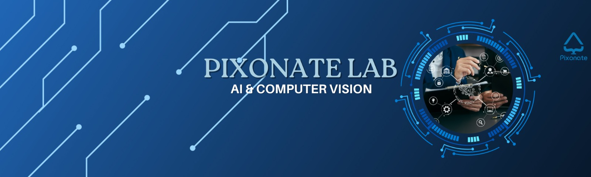

<h1 align="center">Hi 👋, I'm Namrata Patel</h1>
<h3 align="center">AI/ML Intern & Passionate Developer Building Tomorrow's Technology</h3>

  

- 🤖 I'm currently working as **AI/ML Intern at Pixonate Labs**

- 🔭 I'm currently working on **Model Training, Computer Vision, Object Detection, Image Segmentation, Deep Learning**

- 🎓 Certified **AI/ML Developer** and **Problem Solver**

- 🌱 I'm currently learning **Advanced Neural Networks, MLOps, and Production ML Systems**

- 👯 I'm looking to collaborate on **AI/ML projects, Computer Vision applications, and ML model deployment**

- 🤝 I'm looking for help with **Advanced Deep Learning architectures and AI research**

- 💬 Ask me about **Machine Learning, Computer Vision, Model Training, UI Development for AI, and Deep Learning**

- 📫 How to reach me **your-email@gmail.com**

- 📌 I actively contribute to **AI/ML open-source projects**

  

 

<h3 align="center">🛠 Tech Stack & Tools</h3>

###

  
  
  
  
  
  
  
  
  
  
  
  
  
  
  
  
  
  
  
  
  
  
  
  
  

###

<h3 align="center">🚀 Current Focus Areas</h3>

  
🤖 **Machine Learning:** Model Training & Optimization  
👁️ **Computer Vision:** Object Detection & Image Segmentation  
🧠 **Deep Learning:** Neural Networks & Advanced Architectures  
💻 **AI Applications:** Building User-Friendly ML Interfaces  
📊 **MLOps:** Model Deployment & Production Systems  

<h3 align="center">📫 Connect with Me</h3>

  
   
    
  
  
  

 

 

&nbsp;

 

  <i>"Building intelligent systems that bridge the gap between complex AI and real-world solutions"</i> ✨

###
